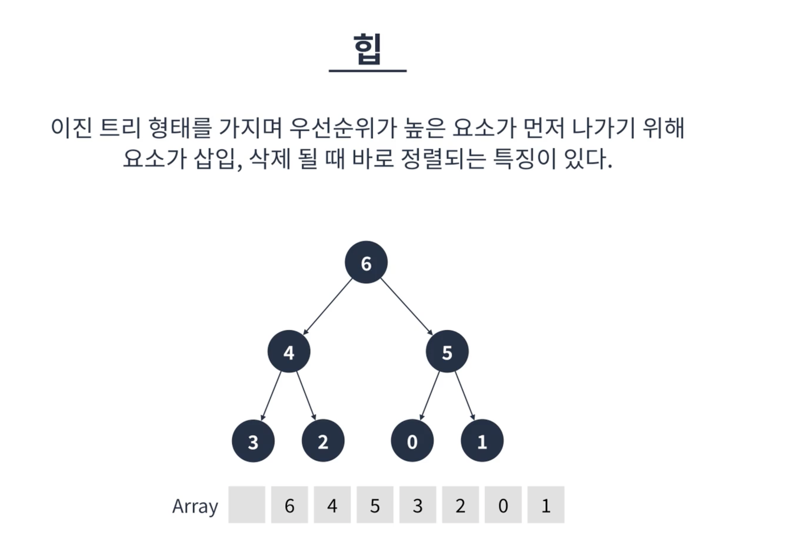

# 힙
우선순위 큐는 FIFO의 특성을 가진 큐와 달리 **우선순위가 높은요소가 먼저 나가는 큐**이다.
우선순위 큐는 자료구자가 아니라 개념이므로 구현하는 방식이 다양함.

자료구조 중 힙이 가장 최적화됨.

힙이란 이진트리 형태를 가지며 우선순위가 높은 요소가 먼저 나가기 위해 요소가 삽입, 삭제 될 때 바로 정렬되는 특징이 있음.

그래서 간혹 힙이 우선순위 큐라고 생각하는 개념이 있지만 다른 것임.

## 특징
* 우선순위가 높은 요소가 먼저나가는 특징을 가진다.
* 루트가 가장 큰 값이 되는 최대 힙(Max Heap)과 루트가 가장 작은 값이 되는 최소힙(Min Heap)두가지로 대략 나뉜다.(오름차순 내림차순 생각.)
* 아쉽게도 JS에서는 직접 구현해서 사용해야한다 :(..

## 동작
힙은 추가,삭제가 핵심 로직

### 추가 알고리즘
* **요소가 추가 될 때는 트리의 가장 마지막에 정점**에 위치한다.(리프리프리프)
* 추가 후 부모 정점보다 우선순위가 높다면 부모정점과 순서를 바꾼다.
* 이 과정을 반복하면 결국 가장 우선순위가 높은 정점이 루트가 된다.
* 요소가 추가 될 때는 항상 이진트리의 마지막에 추가되기에 항상 완전트리의 모습을 가지게 되고, 완전 이진트리의 높이는 log N이기에 힙의 요소 추가 알고리즘은 O(log N) 시간복잡도를 가진다.

### 제거 알고리즘
 * 요소 제거는 루트 정점만 가능하다.
 * 루트 정점이 제거된 후 가장 마지막 정점이 루트에 위치한다.
 * 루트 정점의 두 자식 정점 중 더 우선순위가 높은 정점과 바꾼다.
 * 두 자식 정점이 우선순위가 더 낮을 때 까지 반복한다.
 * 완전이진트리의 높이는 logN이기에 힙의 요소 제거 알고리즘은 O(logN)의 시간복잡도를 가진다.