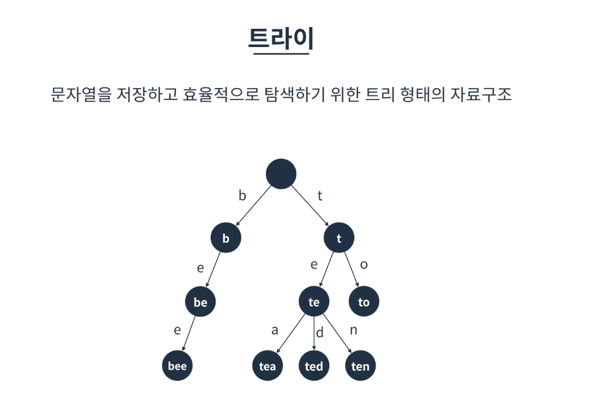
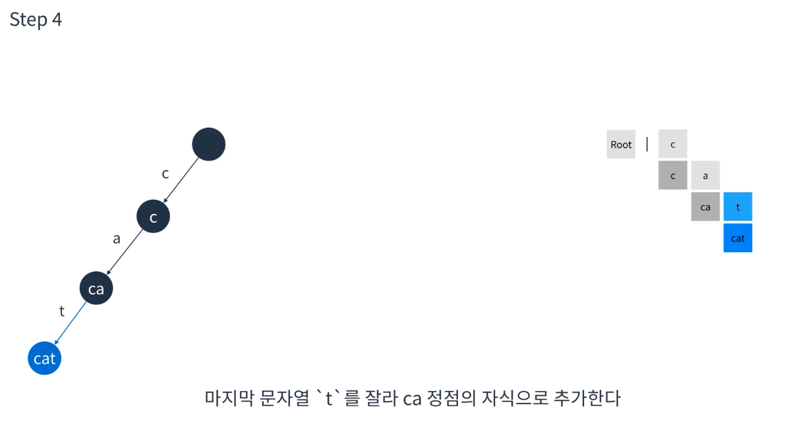
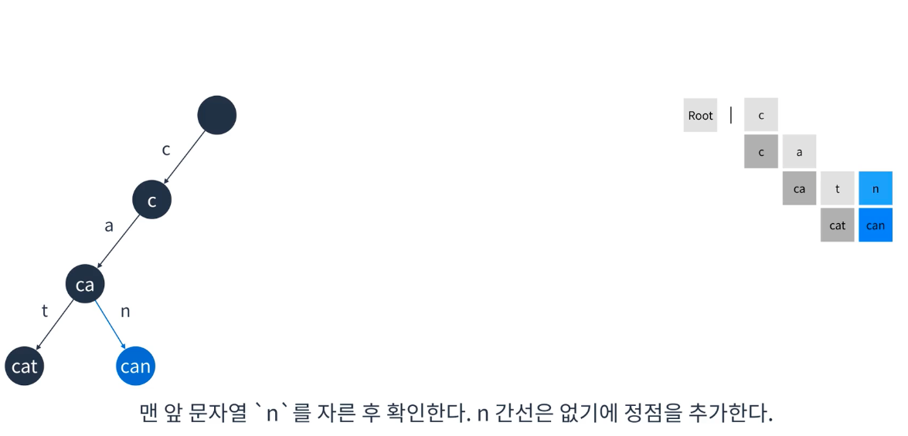

# 트라이

* 비선형 자료구조임
* 구글 네이버 같은 곳에서 자동완성을 할때 이용됨
* 문자열을 저장하고 효율적으로 탐색하기 위한 트리 형태의 자료구조

## 특징
* 검색어 자동완성, 사전찾기 등에 응용될 수 있음
* 문자열을 탐색할 때 단순하게 비교하는 것보다 효율적으로 찾을 수 있다.
  * 문자열 탐색시 문자열의 갯수 * 문자열의 길이만큼 복잡도가 걸리게됨(for루프 사용등..)
  * 트라이는 각 문자열의 길이 만큼만 걸리게 됨
* L이 문자열의 길이일때 탐색, 삽입은 O(L)만큼 걸린다.
* 대신 각 정점이 자식에 대한 링크를 전부 가지고 있기에 저장공간을 더 많이 사용한다..

## 트라이 구조
* 루트는 비어있다.
* 각 간선(링크)은 추가될 문자를 키로 가진다.
* 각 정점은 이전 정점의 값 + 간선의 키를 값으로 가진다.
* 해시 테이블과 연결리스트를 이용하여 구현할 수 있다.

## 예제

1. 처음에는 root만 존재
2. cat인경우 c는 루트  a는 간선 다음 노드는 ca, ca의 간선은 t, 다음노드는 cat
3. can을 여기에 추가한다면 c -> ca까지는 같고 그 다음에 나뉘게 됨