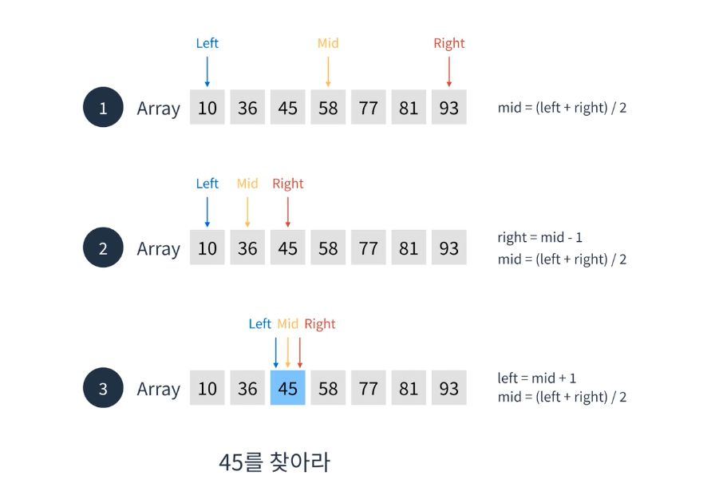
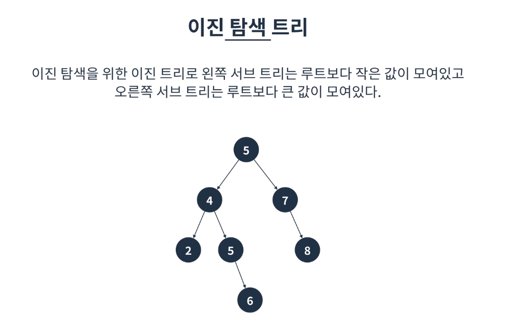

# 이진탐색
* 선형탐색 : 순서대로 하나씩 찾는 알고리즘 : O(n)
* 이진탐색: 업앤다운 게임과 같은 방식이라 생각하면 됨

## 설명
정렬되어 있는 요소들을 반씩 제외하며 찾는 알고리즘(O(logn))만큼 시간복잡도가 걸린다.

## 특징
* 반드시 정렬이 되어있어야 사용할 수 있다.
* 배열 혹은 이진트리를 이용하여 구현할 수 있다.
* O(logn)시간복잡도인 만큼 빠르다

## 구현

* 시작:left, 끝: right, 중간:mid

* 배열을 이용한 방법은 중간요소 추가 또는 삭제 시 선형시간이 걸린다는 단점이 존재함 -> 해소를 위해 이진탐색트리를 사용할 수 있음.

## 이진탐색트리 문제점
* 5,4,3,2,1을 순서대로 추가하는 경우 
* 최악의 경우 한쪽으로 편향된 트리가 될 수 있음
* 그런 경우 순차탐색과 동일한 시간복잡도를 가지게됨
* 이를 해결하기위해 AVL트리나 레드-블랙트리를 이용할 수 있음.