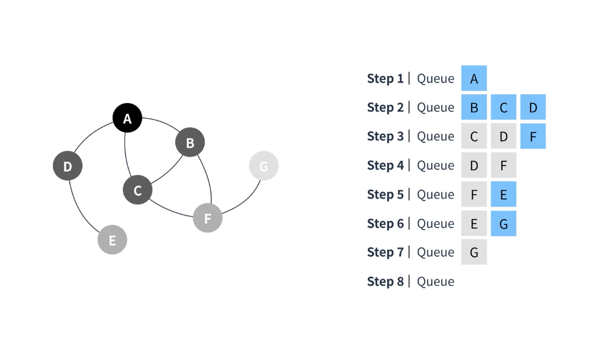
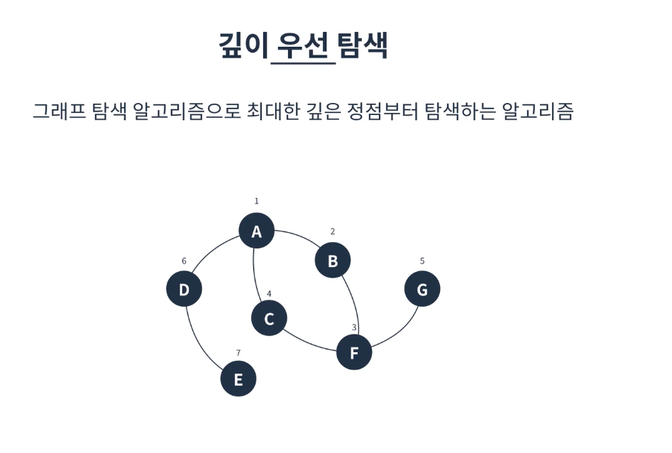
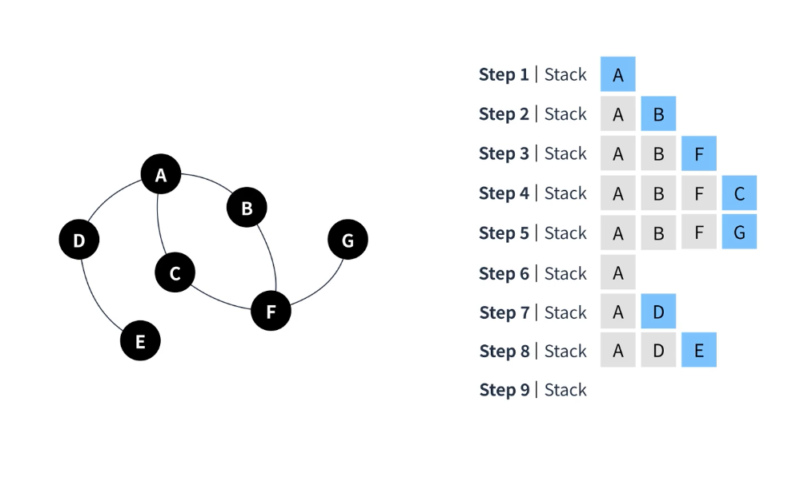

# 너비우선 탐색(BFS-Breadth Frist Search)
* 그래프 탐색 알고리즘으로 같은 깊이에 해당하는 정점부터 탐색하는 알고리즘

## 특징

* Queue를 이용하여 구현할 수 있다.
```javascript
class Queue {
  constructor(){
    this.queue = [];
    this.front = 0;
    this.rear = 0;
  }

  enqueue(value){
    this.queue[this.rear++] = value;
  }

  dequeue(){
    const value = this.queue[this.front];
    delete this.queue[this.front];
    this.front -= 1;
    return value;
  }

  size(){
    return this.rear - this.front;
  }
}
```
* 시작지점에서 부터 가까운 정점부터 탐색한다.
* V가 정점의 수, E가 간선의 수 일 때 BFS의 시간복잡도는 O(V+E)이다.

# 깊이우선 탐색(DFS-Depth Frist Search)

그래프 탐색 알고리즘으로 최대한 깊은 정점부터 탐색하는 알고리즘이다.

## 특징

* Stack을 이용하여 구현할 수 있다.
* 시작정점에서부터 깊은것 부터 찾는다.
* V가 정점의 수, E가 간선의 수 일 때 DFS의 시간복잡도는 O(V+E)이다.
