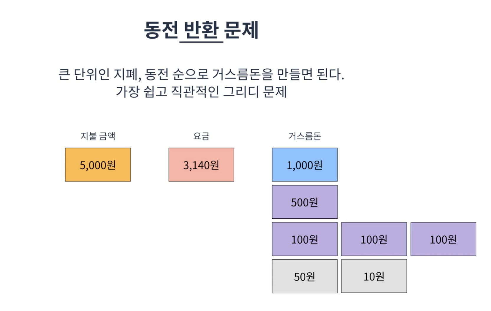

# 그리디
매 선택에서 지금 이순간 가장 최적인 답을 선택하는 알고리즘이며 최적해를 보장해주지는 않음!

## 특징
* 보통 최적해를 구하는 알고리즘보다 빠른 경우가 많다. ***특징상 선형시간으로 끝나는 경우가 많음***
* 크루스칼, 다익스트라 알고리즘등에 사용된다.
* 직관적인 문제에 사용되는 경우가 많음
* 그리디는 특정구현 방법이 존재하는 것이 아닌 하나의 개념임(문제를 풀면서 이해하는 것이 가장 좋다.)

## 동전반환문제

* 거스름돈은 번거롭기 때문에 최대한 큰단위로 거슬러주고싶을 때 어떻게 해야할까 ?
  * 큰 단위인 지폐, 동전순으로 거스름돈을 만들면 된다. (가장 쉽고 직관적인 그리디 문제 중 하나)
