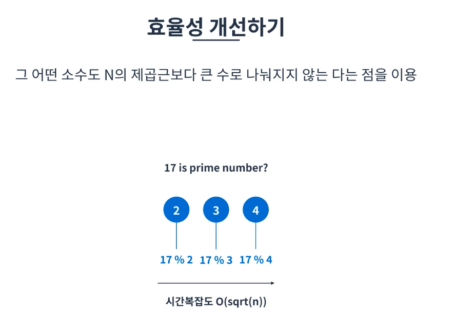

# 소수 구하기
소수는 1 또는 자기 자신만을 약수로 가지는 수임

## 방법

### 가장 직관적인 방법
2부터 N-1까지 루프돌며 나눠 보는 것임
시간복잡도 O(n)을 소요 함 -> 제일 느리므로 코테에서 비추

```javascript
const isPrime = (num) =>{
  for(let i = 2; i < num; i +=1){
    if(num%i == 0){ //나눠지는I는 약수이므로 1이외의 약수가 존재하니 소수가 x -> return false
      return false;
    }
  }
  return true;
}
```
### 효율성 개선

그 어떤 소수도 N의 제곱근보다 큰수로 나눠지지 않는다는 점을 이용
-> 시간복잡도 O(sqrt(n)) ===  O(루트(n))


```javascript
const isPrime = (num) =>{
  for(let i = 2; i*i <= num; i +=1){ //루프 조건만 변경됨
    if(num%i == 0){ 
      return false;
    }
  }
  return true;
}
```

### 에라토스테네스의 체
2~54까지 소수를 찾는다고 가정하는 경우
2를 선택 2의배수가 되는 숫자 모두 선택
3을 선택 3의배수가 되는 숫자 모두 선택
4는 체크 되어서 건너띔
5를 선택 5의 배수가 되는 25,35 체크
6은 체크됨 넘어감
7의 배수인 49 체크
8부터는 54의 제곱근인 7.xxx보다 크므로 패스함
여기서 이제 선택되지 않은 모든 수는 소수가 되는것
-> O(n log log n)을 따르게 됨

```javascript
const getPrimes(num) {
  //인덱스이므로 0,1 false처리 (1은 소수아니니께)
  const prime =[false,false, ...Array(num-1).fill(true)];

  for(let i = 2; i*i <= num; i +=1){
    if(prime[i]){
      //배수 모두 체크 Ex) prime[i]가 3인경우 6부터 6, 6+3인 9  6+3+3 = 12 ....
        for(let j = i * 2; j <=num; j+=i){
          prime[j] = false; 
        }
    }
  }

  return price.fileter(Boolean);
}
```
종종 코테에 등장하므로 에라토스테네스의 체 알고리즘은 어느정도 외워놓는게 좋다.

