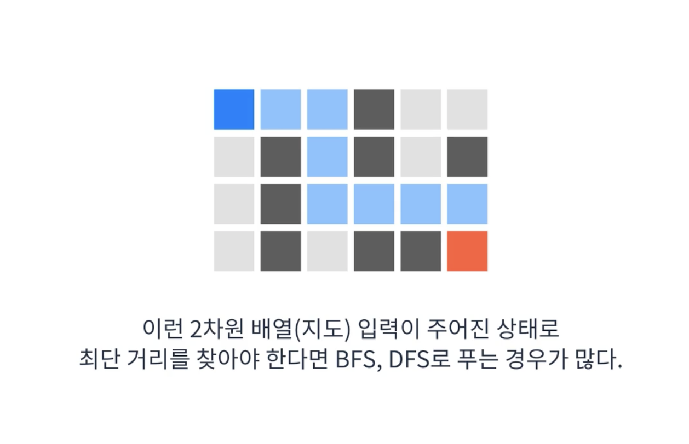
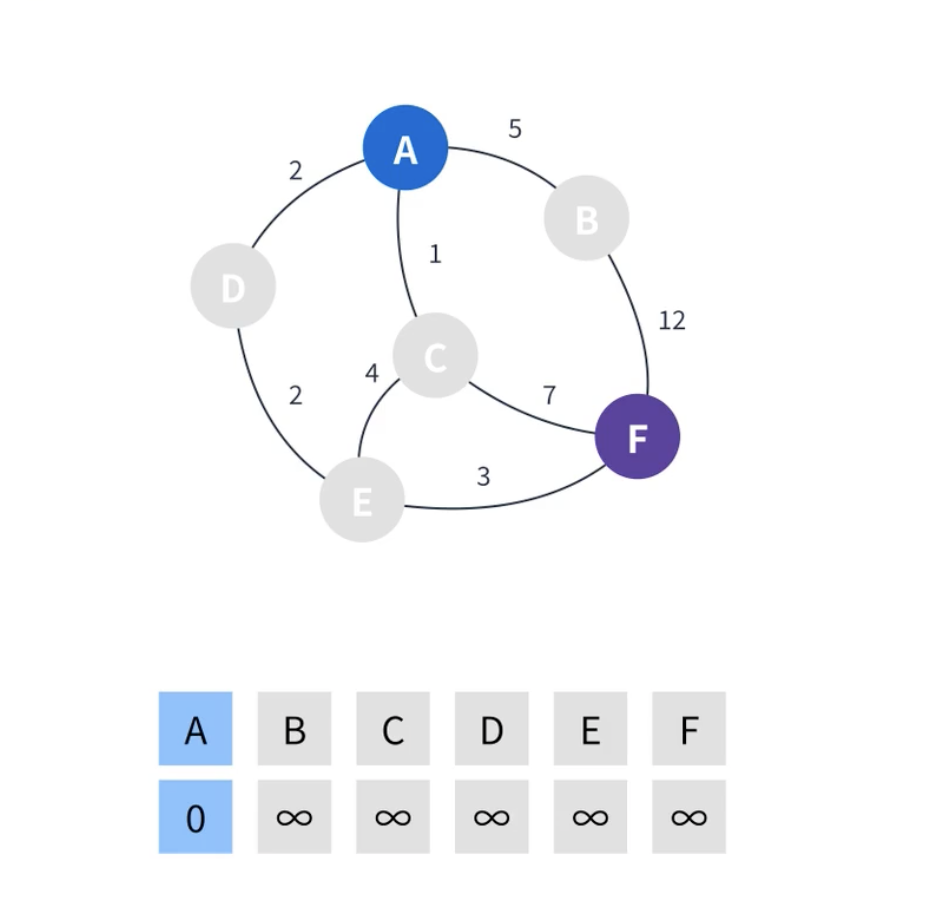

# 최단 경로 알고리즘이란?
* 그래프에서 특정 정점에서 목적지까지 가는 최단 경로를 구하는 알고리즘
* 이전에 배운 BFS, DFS도 최단경로 알고리즘으로 사용할 수 있다.
* 대표적인 최단경로 알고리즘으로는 다음과 같은 알고리즘이 있다.
  * BFS
  * Dijkstra(다익스트라) -> 이번 시간에 배울 것임 ㅎㅅㅎ
  * Bellman-Ford's (벨만-포드)
  * Floyd Warshall  (플로이드 와샬)
* 목적지에 따라 알고리즘을 선택할 수 있어야함

## BFS, DFS
그래프의 간선 가중치가 모두 같을 때(없을 때) 적합한 알고리즘으로 여겨짐

* 위 사진의 경우 배열의 한 칸이 정점이 되고 위 아래 오른 왼이 간선이 됨 
* 간선의 가중치는 공평하게 1이 될 것임.

## Dijkstra
그래프의 간선 가중치가 각각 다른 경우에 적합하다.
간선의 가중치가 있고 가중치가 모두 양수일때 사용하기 적합한 알고리즘

* 네델란드 수학자, 컴터 과학자 아저씨 Edsger Wybe Dijkstra가 고안한 최단 경로 알고리즘임
* 원래 발음은 데이크스트라에 가깝다고 한단다
* 우선순위 큐를 이용해서 만들 수 있다.
* 시간복잡도는 V가 정점의 수 , E가 간선의 수일 때 O(E log V)이다.

### 해설

1. 시작점을 제외한 나머지 정점의 거리를 무한대로 초기화하고 시작점의 거리는 0으로 초기화
2. 시작점에서 갈 수 있는 정점을 찾고 각 정점에 가중치를 더 해줌 
    - ex)A-0, B-5, C-1,D-2
3. 설정한 정점 중 가장 최단거리가 짧은 정점을 선택함 (C는 1로 C가 선택됨)
4. C에서 갈 수 있는 정점을 찾고 가중치를 더해서 기재 해줌.
    - ex) E-(4+1=5), F-(7+1=8)
5. C는 방문처리 하고 C다음으로 작은 가중치를 가졌던 D가 선택됨.
    - D는 이미 값이 기재 되어 있었으나 D의 관점에서 E로가는 가중치는 2+2 로 4 이므로 기존에 E에 기재된 5는 삭제되고 4로 다시 기재 됨.
    - 이제 D는 방문처리 됨
6. 다음으로 작은 정점인 E-4가 선택됨(B-5보다 작음)
    - E에서 갈 수 있는 정점은 F뿐이고 계산해보면 기존 값 8 을 대체해서 7을 기재 함 
    - E는 방문 처리함
    - 도착점을 제외한 마지막 정점인 B를 선택
7. B에서 갈 수 있는 정점은 F밖에 없음
    - 이번에는 계산한 가중치 12가 F의 기존 값인 7 보다 커서 갱신 안함
    - 마지막으로 도착점은 F만남았고 F의 값은 7이므로 가장 최단경로는 최종값인 7 임

가장 낮은 정점을 계속해서 선택해주어야 하기 때문에 다익스트라 알고리즘의 핵심은 `우선순위 큐`이다.

### 정리
1. 시작점을 제외한 모든 정점의 거리를 무한으로 설정한다. 시작점은 0으로 설정한다.
2. 시작점을 선택한다.
3. 선택한 정점에서 갈 수 있는 정점의 거리를 `정점(해당 정점까지의 최단거리)값 + 간선(거리)값`으로 갱신한다.
4. 선택한 정점을 방문처리한다.
5. 이미 방문한 정점과 무한인 정점을 제외하고 `가장 최단거리인 정점`을 선택한다.
6. 더 이상 방문할 수 있는 정점이 없을 때 까지 3~5를 반복한다.
7. 도착점의 값을 확인한다.
