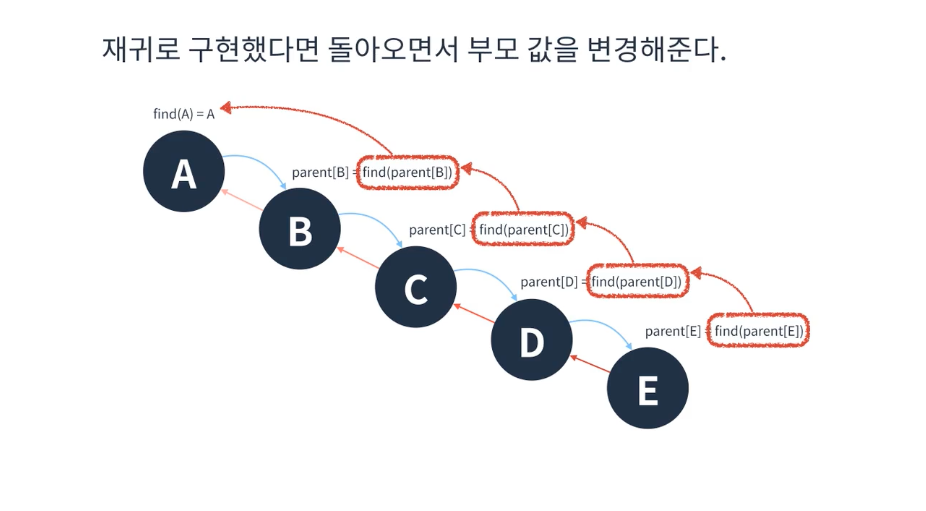
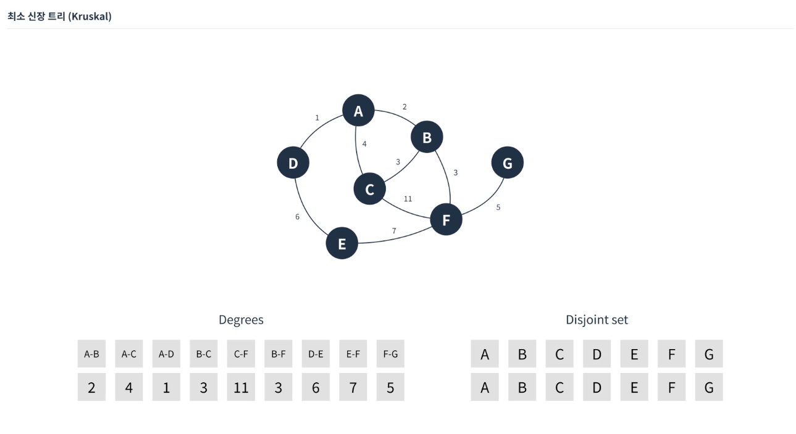
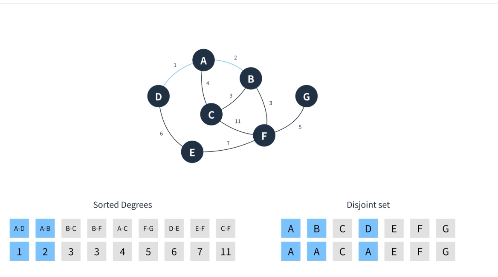
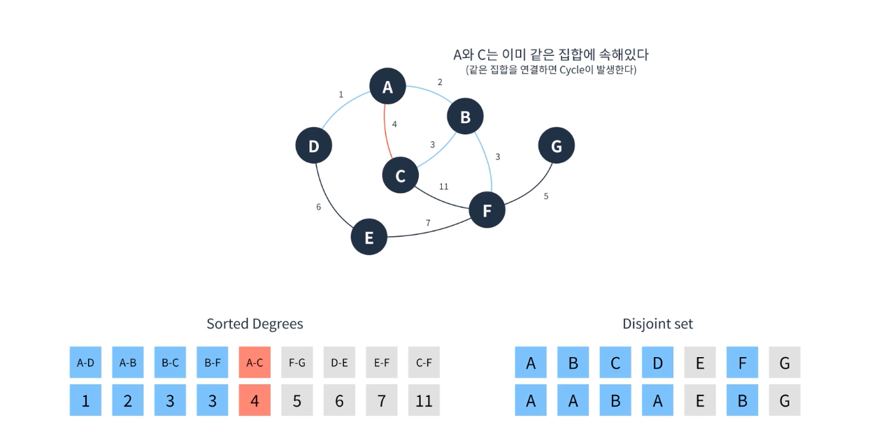
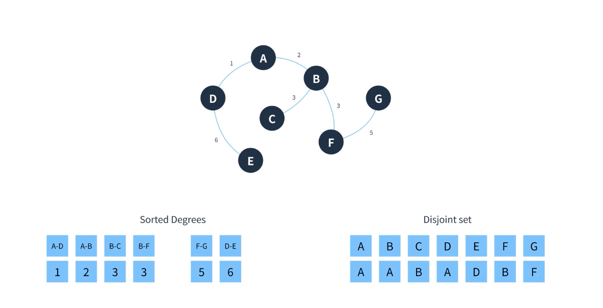

# 최소신장트리
* 신장트리(Spanning tree)란 그래프 내에 모든 정점을 포함하는 최소 연결 부분 그래프다.
* 여기서 최소신장트리(MST)는 다음과 같은 조건을 만족한다.
  * 최소한의 간선으로 모든 정점이 연결되어야 한다.
  * 모든 신장트리 중 가중치의 값이 최소여야 한다.
  * Cycle이 발생해서는 안된다
* 최소 신장트리를 위한 알고리즘은 대표적으로 두가지가 있다.
  * 크루스칼(Kruskal)
  * 프림(Prim)

  ## 크루스칼알고리즘을 위해 미리알아두면 좋을 것
  * 그리디 개념을 이용하여 구현할 수 있다.
  * 먼저 모든 그래프를 부분집합으로 분리한다.
  * 가장 가중치가 낮은 간선을 선택하고 부분집합을 연결한다.
  * 이 때 Cycle이 발생하지 않도록 주의한다
    * 공통 최상위 부모를 찾는것으로 막을 수 있다.
    * Cycle을 판단하기위한 알고리즘으로 Union-Find알고리즘을 이용할 수 있다.

### Union-Find 알고리즘이란?
  * 서로소 집합을 구하기 위한 알고리즘
    * 공통 원소가 없는 두집합을 표현하기 위한 자료구조가 서로소 집합
  * 서로 다른 두집합을 병합하는 연산 Union과 집합의 원소가 어떤 집합에 속해 있는지를
  판단하는 연산 Find를 나타낸다.
  * 보통 트리구조로 구성한다
  * 편의상 재귀로 구현하는 경우가 많다.

  #### Union
  두 원소를 하나의 집합으로 합쳐주는 작업
  1. 초기에는 각 원소 자기자신은 자기자신이 속한 집합이라고 가정(자기 자신을 부모 정점으로 설정, key는 원소 ,value는 자신이 속한 부모 정점)
  2. B가 A에 속할 경우 B의 부모 원소를 A로 지정
  3. E가 C에 속하는 경우 E의 부모원소는 C
  4. 여기서 E가 B에도 속할 경우 E의 최상위 원소를 B로 만드는 것이 아님
  5. C와 E가 속한 최상위 원소인 C의 부모를 A,`B`,D가 속한 집한의 최상위 원소인 A로 바꿔줘야함. 이렇게 집합을 합쳐주는 것

  #### Find
  가장 간단한 방법은 부모원소가 자기 자신일 때 가지 올라가기
  1. 같은 집합인지 알고 싶으면 두원소 비교를 할 때 가장 최상위 원소로 가서 비교해주면 됨
    - 만약 편향트리라면 O(n)이 소요된다. ->성능이슈
  2. 경로 압축을 통해 성능 해결이 가능함
  
    - 모든 경로 탐색이 아닌 돌아오면서 부모값을 변경해줌. ->이러면 거의 상수시간 걸린다고함.

  ## 최소신장트리 (Kruskal 알고리즘)
  
  1. 데이터를 간선과 서로소 집합으로 구성
  2. 탐욕적 탐색을 위해 간선들을 정렬해줌
  
  3. 가장 가중치가 낮은 간선을  선택하고 두 정점을 한 집합으로 이어줌
  
  4. A는 자신, C의 최상위 부모는 B를 거친 A가 되므로 cycle발생 -> 일단 pass
  
  5. 패스한 간선의 집합들을 제거하고 보면 최소신장트리가 완성됨

## 정리
* 가장 가중치가 낮은 간선부터 선택하는 것 =Greedy
* 각 원소가 같은 집합인지 확인하기 위한 알고리즘 = Union-Find
* 두 정점이 같은집합에 속한다면 = Cycle