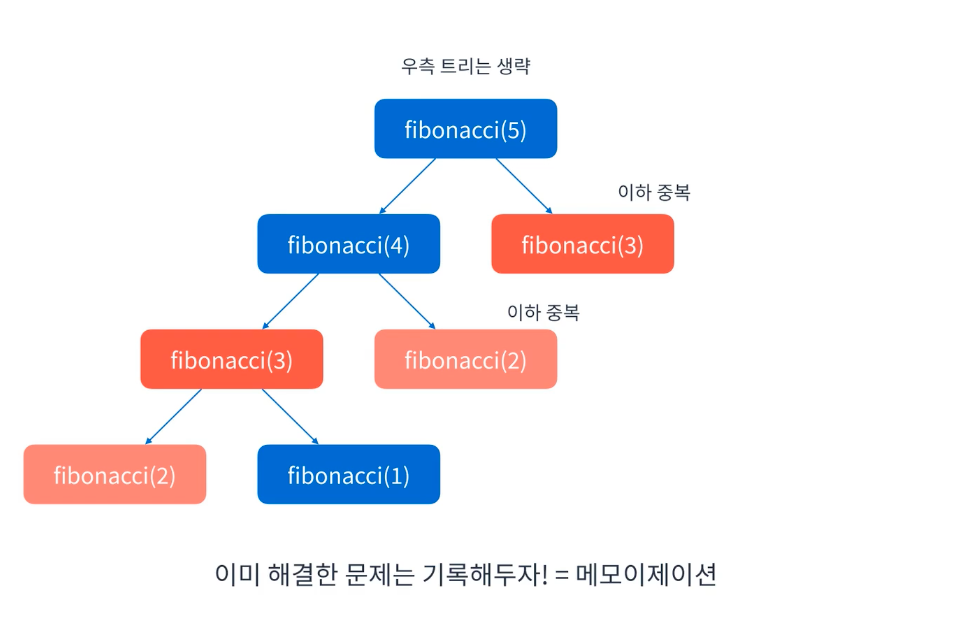
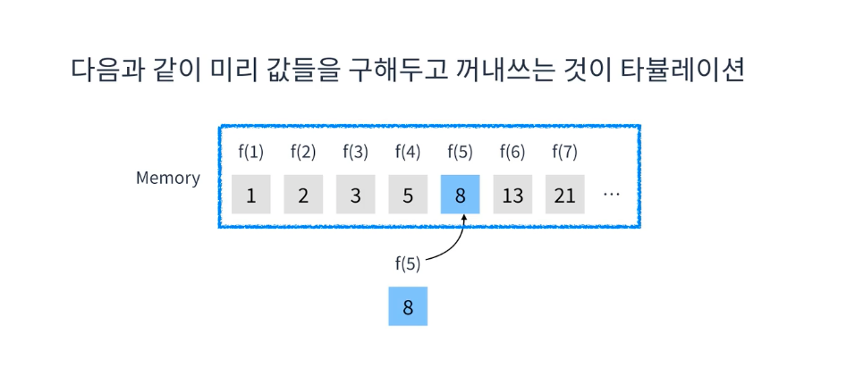

# 동적 계획법
* 해결한 작은 문제로 큰문제를 해결하는 문제풀이 방식
* 그리디나 백트래킹 처럼 특정 알고리즘이 아닌 ***문제 해결 방식을 뜻한다!***
* Dynamic Programming(DP)라고도 부른다.
  * 동적계획법이 어렵게 느껴지는 원인 중하나다
  * 다이나믹하지도 않고 프로그래밍이라도 관련이 없음
* 메모리를 많이 사용하는 대신 빠른 성능을 자랑한다.
* 두가지 방법론이 있다
  * 메모이제이션(Memoization)
  * 타뷸레이션(Tabulation)

## 메모이제이션

* 하향식 접근법
  * 작은 문제를 저장했다 꺼내쓰는 방식
* 동적계획법에서 작은 문제들의 결과는 항상 같음
* 이 결과들을 메모리에 저장해서 필요할 때 꺼내쓰는 방식
* 백트래킹 방식에서 피보나치수열을 생각해보면 구해야하는 수열이 뒤에 있을 수록 시간이 오래걸림
  * 그래서 이미 해결된 결과값에 대한 결과는 미리 메모리에 저장해놓고 가져다 쓰자는 이론임

  ### 예시
  * 피보나치수열의 가장 작은 문제는 f1, f2임
    * 이게 각각 1이라는 것을 알고 있음
  * 작은문제로 큰 문제를 해결할 수 있는가 ?
    * 점화식(fn = fn-1 + fn-2)로 가능함.
  * 이렇게 메모이제이션을 하면서 다음값을 구해나갈 수 있음

## 타뷸레이션

* 상향식 접근법
* 필요한 값들을 미리 계산해두는 것
* 메모이제이션은 필요할 때 계산한다면 (Lazy Evaluation)
  - 타뷸레이션은 미리 계산해둠(Eager Evaluation)
* 보통 코딩테스트에서는 메모이제이션을 쓰는 경우가 대부분임.

# 동적 계획법문제는 어떻게 접근할까?
* 동적계획법 유형은 키워드만으로 동적계획법인지 알기 어렵다.
* 그렇기 때문에 문제유형을 알 수 없다면 다음을 확인해보면 된다
  * 가장 작은문제를 정의할 수 있는가?
  * 작은문제를 통해 큰문제를 해결할 수 있는 규칙이 있는가 ?
* 위 두가지가 가능하다면 동적계획법임
* 간혹 메모리를 너무 사용하여 통과 못하는 경우가 있음
  * 이런 경우 백트래킹을 이용할 수 있지만 보통 코테에선 잘 안나온다고 함
  