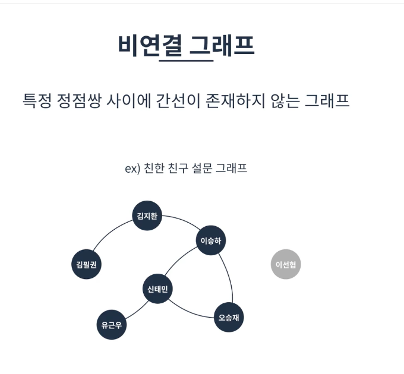

# 그래프

정점과 정점사이를 연결하는 간선으로 이루어진 비선형 자료구조이다.
정점 집합(Node)과 간선집합(Edge)으로 표현 가능함.

실제 사용되는 경우는 지하철 역과 페이지랭크(하나의 페이지가 정점이되고 파생되는 링크들이 간선이 된다. ) 알고리즘에 사용 됨.

## 특징
* 정점은 여러개의 간선을 가질 수 있다.
  * 선형 구조인 경우 앞 뒤로 하나의 자료만 가질 수 있었으나 비선형인 경우 앞뒤로 여러개를 가질 수 있게 됨.
* 크게 방향그래프와 무방향 그래프로 나눌 수 있음
* 간선은 가중치를 가질 수 있음
* 사이클이 발생할 수 있음
  * 탐색 시 계속 탐색이 가능한 경우가 생길 수도 있으므로 조심

  ### 무방향 그래프
  
  간선으로 이어진 정점끼리는 양방향으로 이동이 가능하다.
    표현하기에 (A,B)와 (B,A)는 같은 간선으로 취급된다.
    예로는 양방향 통행도로가 존재한다.
  ### 방향그래프
    
    간선에 방향성이 존재하는 그래프이고 양방향으로 갈 수 있더라도 <A,B> 와 <B,A>는 다른 간선으로 취급된다(일방통행도로의 케이스)
  
  ### 연결 그래프
  
  모든 정점이 서로 이동 가능한 상태인 그래프 
    *  특정정점에서 다른 정점까지 모든 경우의 수에 이동이 가능해야함

  ### 비연결 그래프
  
  특정 정점쌍 사이에 간선이 존재하지 않는 그래프

  ### 완전 그래프
  
  연결그래프를 넘어서 모든 정점끼리 연결된 상태인 그래프를 말한다.
    *  따라서 한 정점의 간선 수는 모든 정점의 개수 -1 이 된다.
    * (모든 정점의 수 - 1 )* 모든 정점의 수 = 모든 간선 수

  ### 사이클
  
  그래프의 정점과 간선의 부분집합에서 순환이 되는 부분

## 그래프의 구현방법

인정행렬과 인접리스트 두가지 방식으로 그래프를 표현할 수 있다.
