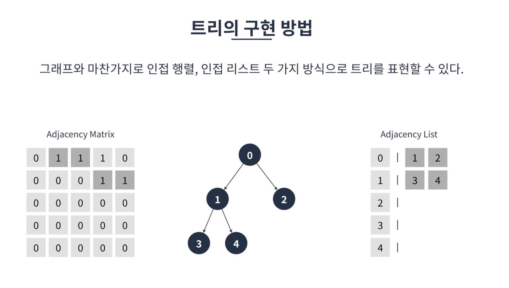
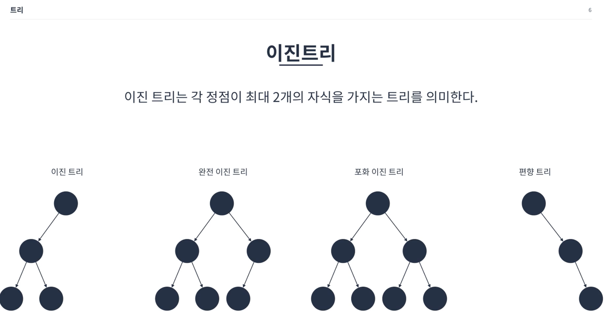
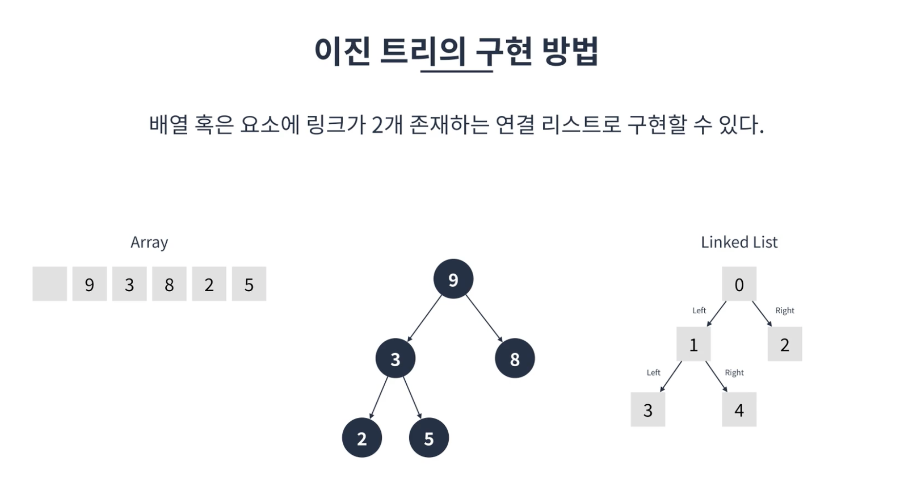

# 트리

방향 그래프의 일종으로 정점을 가리키는 간선이 하나밖에 없는 구조를 가지고 있다. (조직도, 폴더구조를 생각해보자.)

각 정점은 노드라 부르며 더 이상 자식이 없으면 리프노드라고 부른다
루트로부터 몇번째 깊이인지를 표현할 때 레벨이라고 말함.
한 정점에서 뻗어나가는 간선의 수를 차수(degree)라고 부름

## 특징
* 루트 정점을 제외한 모든 정점은 반드시 하나의 부모 정점을 가진다.
* 정점이 N개인 트리는 반드시 N-1개의 간선을 가진다.
* 루트에서 특정 정점으로 가는경로는 유일하다.

## 종류
### 이진트리

  각 정점이 최대 2개의 자식을 가지는 트리를 의미한다.
  * 특징
    * 정점이 N개인 이진트리는 최악의 경우 높이가 N이 될 수도 있다(편향트리)
    * 정점이 N개인 포화 또는 완전 이진트리의 높이는 log N이다.
    * 높이가 h인 포화 이진트리는 2^h-1개의 정점을 가진다.
    * 일반적인 이진트리를 사용하는 경우는 많지 않으나 이진탐색트리, 힙, AVL트리, 레드블랙트리등의 자료구조에 응용된다.
  * 구현
  
  