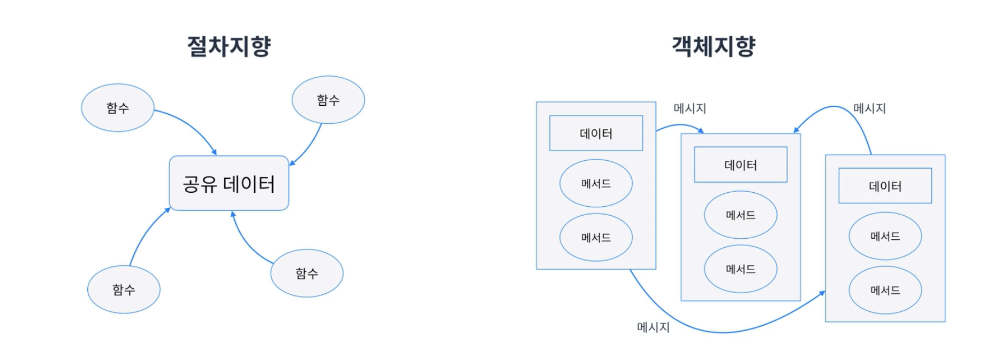

# 객체
객체지향에서 객체는 현실에서 있는 것을 추상화 한것이다.
 -> 현실에 존재하는것을 코드로 옮기는 것은 아님

 * 지구 vs 지도 vs 지구본이라고 생각해보자
 * 추상이란 사물이 지니고 있는 여러 측면 중 특정한 부분만 보는 것이고 그 이외에 필요없는 부분은 버리게 된다.
  * 메르카토리 지도라고 본다면 위도 경도가 필요한 경우를 추상화해서 사용하는 것임
  * 이처럼 현실에 있는 것을 특정관점에서 바라보아 객체로 바라보는것을 추상화 혹은 모델링이라고 한다.

## 객체지향이란

* 객체 위주로 설계하고 프로그래밍하는 패러다임이다
* 객체지향 언어에서는 추상화의 최소단위가 객체이다
* 각각의 객체는 메시지를 주고 받을 수 있다.

* 절차지향은 공유데이터를 각 함수가 절차적으로 직접 통제한다면
* 객체지향은 객체가 데이터를 관리하고 각각 메시지를 통해 절차를 간접적으로 통제한다.

## 객체지향의 오해
* 객체지향은 패러다임일뿐 언어와는 관계가 없음.
* 언어는 지향하는 것을 조금 더 편하게 구현할 수 있게 도와줄 뿐임
* 클래스가 없는 Js, Go, C언어로도 객체지향 프로그래밍을 할 수 있음.
* JS는 프로토타입을 통해 가능하긴 함
* 절차지향보다 객체지향이 무조건 더 좋은것은 아님
* 만들어야 하는 프로그램에 따라 절차지향이 더 적합할 수 있음
  * 비교적 간단한 프로그램일 수록 절차지향이 더 만들기 쉽고 직관적임
* 객체지향은 객체간 통신하기 때문에 흐름이 더 직관적이어 더 복잡한 프로그램에 적합함.

# 프로토타입
JS의 객체는 클래스 기반 언어처럼 속성(Attributes)과 행위(Method)를 정의할 수 있다.
```javascript
const person = {
  name: "이상훈", //속성
  company: "IDKNOW",
  move: function(destination){ //행위
    console.log(`${destination}으로 이동합니다.`)
  }
}

console.log(person.name); //이상훈
console.log(person.company) //IDKNOW
person.move("강남") // 강남으로 이동합니다.
```

## JS에서 객체의 생성 방법

### 1. 객체 리터럴
브레이스를 이용해 직접 객체리터럴로 생성
```javascript
const person = {
    name: "이상훈", //속성
  company: "IDKNOW",
  move: function(destination){ //행위
    console.log(`${destination}으로 이동합니다.`)
  }
}
```

### 2.Object생성자 함수
이경우 person의 상위객체는 Object가 된다.
```javascript
const person = new Object();
person.name = "이상훈";
person.company="IDKNOW"
person.move =   function(destination){
    console.log(`${destination}으로 이동합니다.`)
  }
```

### 3.생성자 함수
```javascript
function Person(name, company, move) {
  this.name = name;
  this.company = company;
  this.move = function(destination) {
        console.log(`${destination}으로 이동합니다.`);
  }
}
```

## 프로토타입 활용

좌측의 Person의 네임과컴퍼니를 설정했음 두 객체모두 메서드가 따로 정의됨
같은내용인데 따로 정의되어 메모리 낭비가 됨

이를 해결하기 위해 프로토타입이 사용 가능함.


### 상속 흉내내기
```javascript
function Person(name) {
  this.name = name;
}

Person.prototype.getName = function () {
  return this.name || '상훈'
}

function Korean(name) {};
Korean.prototype = new Person();

const lee = new Person("이상훈");
const kim = new Korean("김상훈");

console.log(lee.getName()); //'이상훈'
console.log(kim.getName()); //'김상훈'
```
상속흉내 : 엄밀히 따지면 상위객체에서 하위객체를 좀 더 잘만드는 방법임
1. 하위객체로 만들 생성자 함수를 만든 후 해당 하위 생성자 함수(Korean)의 프로토타입으로 상위 객체(Person)를 대입함.
2. 이러면 상위객체함수가 링크되어 프로토 체이닝을 통해 찾아감
3. 근데 이러면 내부적으로 생성된 프로토타입 변수는 사용할 수 가 없음


### 부모생성자 빌려쓰기
```javascript
function Person(name) {
  this.name = name;
}

Person.prototype.getName = function () {
  return this.name || "상훈"
}

function Korean(name) {
  Person.apply(this, arguments);
};
Korean.prototype = new Person();
Korean.prototype.setName = function (name) {
  this.name = name;
}

const lee = new Person("이상훈");
const kim = new Korean("김상훈");

console.log(lee.getName()); //'이상훈'
console.log(kim.getName()); //'김상훈'
kim.setName("요호호호호");
console.log(kim.getName()); //'요호호호호'
```

1. apply를 통해 부모생성자를 이용해 내부 변수에 접근 가능해짐

### Object.create
기존객체를 재 활용할 수 있다.
kim은 lee를 복제해서 만들 수 있게 됨.
```javascript
const lee = {
  name: "이상훈",
  getName: function() {
    return this.name;
  }
}

const kim = Object.create(lee);
kim.name = '김상훈';

console.log(lee.getName()); // 이상훈
console.log(kim.getName()); // 김상훈
console.log(lee.__proto__) //{}
console.log(kim.__proto__) // {name:'이상훈', getName: [Function: getName]}
```
