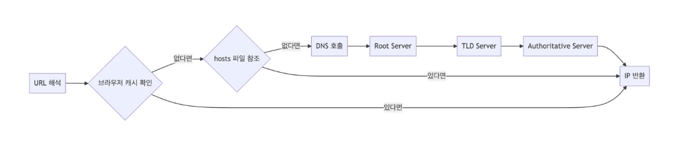
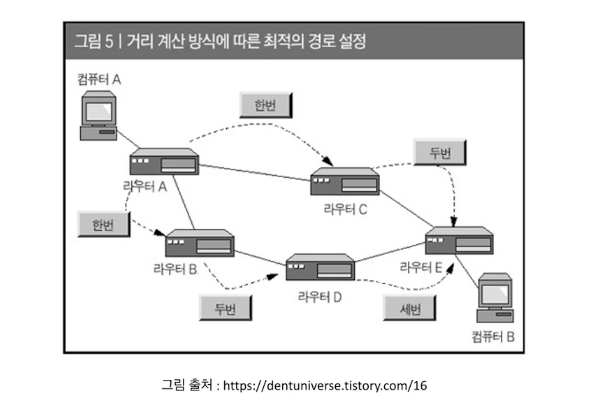
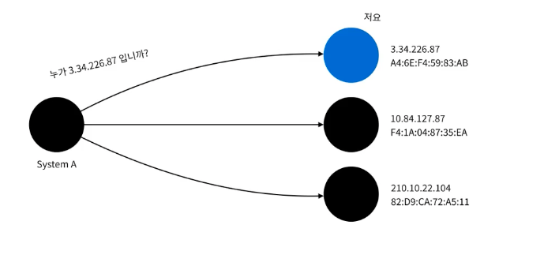
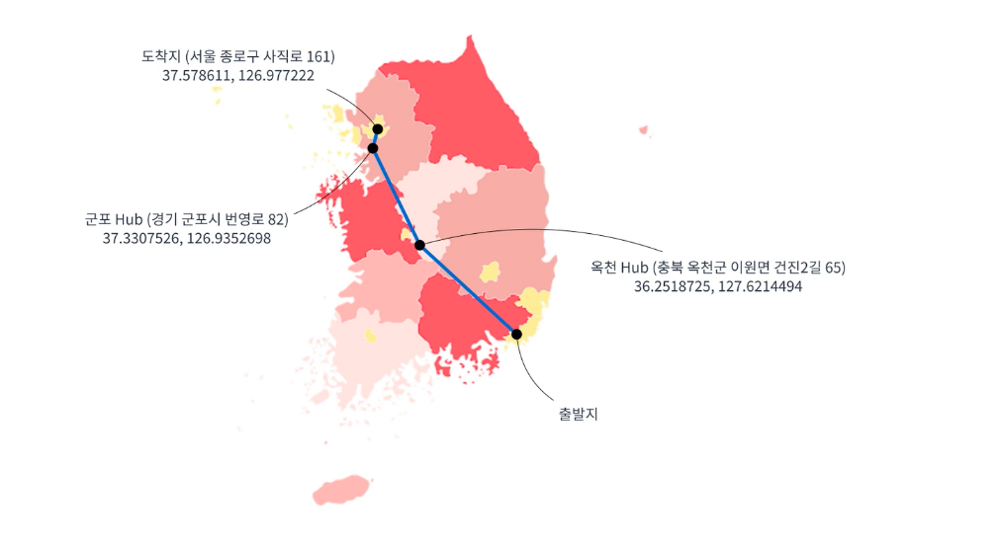

# 네트워크 기초(브라우저에 URL을 입력하면 무슨일이 발생할까?)

# 1. URL을 해석한다.
URL은 scheme: 유저정보, 패스워드 @ 호스트 : 포트/ url 경로
로 이루 어짐
* scheme: 프로토콜이 들어가는 영역(http의 경우 웹 인터넷 전용 프로토콜, ftp도 존재)
* 계정정보(user: password)는 인증이 요구되는 URL인 경우 접속허가를 받을 수 있게 됨 (ftp 생각)

## EX
*  http://example.com:8761/members
* ftp:// admin@password1234@example.com/image.png

# 2. DNS를 조회

* Domain Name System =>  DNS는 도메인과 IP주소를 서로 변환해준다.
* DNS로 요청을 보내기 전에 브라우저 캐시와 hosts파일을 참조한다.
* DNS는 보통 통신사(ISP)에서 제공하는것을 사용한다.
* DNS를 운영하는 서버를 보통 Name Server라고 부른다.
* present.do, www.present.do, dev.present.do의 전부 도메인은 present.do 이다(AWS Route 53 생각) 나머지 www등 서브도메인이 붙은경우를 호스트라고 한다.

# 3. 해당IP가 존재하는 서버로 이동 

-> 해당 IP가 존재하는 대역으로 라우팅을 통해 이동하게 됨
예를들어 한국에서 미국에 있는 서버를 요청하게 되면 여러 라우팅을 통해 해당 서버(미국)가 있는 대역으로 이동하게 됨.
* 네트워크 장비 라우터를 통해 이동한다.
* 동적 라우팅을 통해 이동한다.

# 4. ARP를 이용하여 MAC주소 변환을 한다.

* Address Resolution Protocol 
* 논리주소인 IP주소를 물리주소인 MAC주소로 변환하는 프로토콜이다.
* 실제 통신을 위해 변하지 않는 고유한 MAC주소가 필요하다.
* 네트워크 내에 ARP를 BroadCasting하면 해당 IP주소를 가지고 있는 기기가 MAC주소를 반환한다.
## 4.1 IP 주소와 MAC 주소의 필요성
  * IP는 논리적 주소 (3.13.123.42)
  * MAC는 물리적인 주소  (A1:6B:C0:10:10:DE)
  -> 기계의 실제 위치를 알기위해서는 MAC주소가 필요하다
  * 논리적 주소와 물리적 주소로 나눈 이유는 둘의 사용용도가 다르기 떄문임
      ### EX)
      * 교보의 주소는 종로1임(IP주소) 근데 종로1만 보고 이것이 어디있는지 어떻게 알 수 있는가 ? ->정확히 알 수 없음
      * 그래서 실제 종로1의 위치인 GPS위치(MAC주소)를 알면 실제 위치를 알 수 있게 되는 것(북위 123 123 123 동경 123 123 123)
## 4.2 만약 교보로 택배를 보낸다면 ?

  * 서울로 접근 ->  종로구 접근 -> 종로 1가 탐색 하게 됨
  *  그러면 탐색순서가 서울의 진짜위치(MAC주소) -> 그다음 종로구의 진짜위치 -> 그다음 종로1가의 진짜위치를 탐색하게 됨
  * 마치 ARP를 이용한것과 비슷함 -> 이처럼 IP는 대역을 통해 범위를 좁혀나가는 용도로 사용 되게 됨.
  * 만약 대구에서 종로1로 택배를 보내게 되면 택배의 중간경로인 옥천Hub의 진짜위치를 알아내서 이동하고 그다음 군포 Hub의 진짜위치를 알아내서 이동하고 그 다음 도착지인 서울의 진짜위치를 알아내서 이동하고 ... 최종목적지에 도착하게 됨.
  * 여기서 옥천 Hub, 군포 Hub가 라우터라고 보면 됨

  # 5. TCP통신을 통해 Socket을 열어야 한다.
  * 네트워크를 통해 해당기기로 패킷을 전달한다.
  * 3way handshake로 연결을 요청한다.
  * 요청이 수락되면 기기는 패킷을 받아 처리한다.
  * 여기서 수락이 되면 데이터를 서버로 전달하게 됨.
  -> 물건을 전달한다면 초인종을 눌러 허락을 받는 과정이라 생각하면 됨-> 거절당하면 물건 못주듯

  # 6. 서버는 응답을 반환한다.
  * HTTP프로토콜로 들어온 패킷을 읽고 처리한다.
  * 요청에 따른 적절한 응답값을 반환한다.
    -> 보통 URL을 브라우저에 입력하면 HTML을 보내줌
  
  # 7. 브라우저는 렌더링을 하게 된다.
  * HTML을 읽어 DOM Tree를 구축한다.
  * 만들어진 DOM Tree를 이용하여 화면에 그린다
  * 스크립트를 실행한다.
