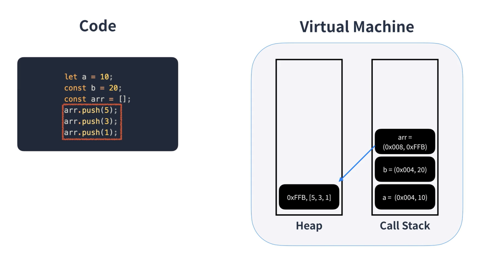

# JS의 메모리

```md
let (키워드) variable(변수이름) = "value"(값)
```

변수에 고유식별자를 생성하고 메모리에 주소를 할당하고 할당한 메모리에 값을 넣음

## 원시타입
JS는 원시타입 변경시 새로운 메모리 주소에 새로운 값을 할당함


## Virtual Machine

JS의 VM은 힙과 콜스택 영역으로 나뉨
* Heap은 참조타입이 들어감
* Call Stack은 원시형 타입이 들어감.
* 배열을 선언할 때 메모리에 해당 배열을 가진 변수는 콜스택으로 들어가지만 이를 참조하는 것들의 주소들은 Heap으로 들어감

## Garbage Collector
사용하지 않는 메모리를 정리하는 역할
참조가 되지 않는 메모리값들을 확인해 비워 줌.

### Mark and Sweep Algorithm
* 현대적 브라우저는 이 알고리즘을 사용해서 메모리를 정리함
* 브라우저의 최상위 객체인 윈도우를 루트로 하여 닿을 수 없는 주소를 더 이상 필요없는 주소로 정의하고 지우는 알고리즘이다.

## 정리

* 이 처럼 메모리는 참조에 대해서 잘 알고 있어야함
