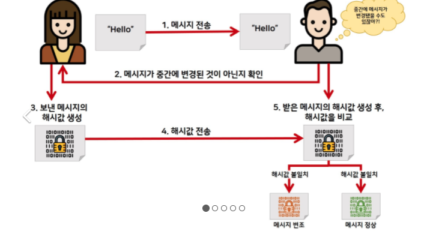
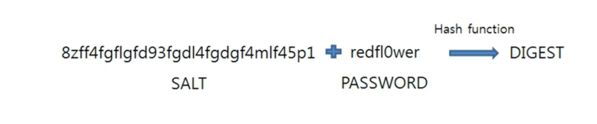
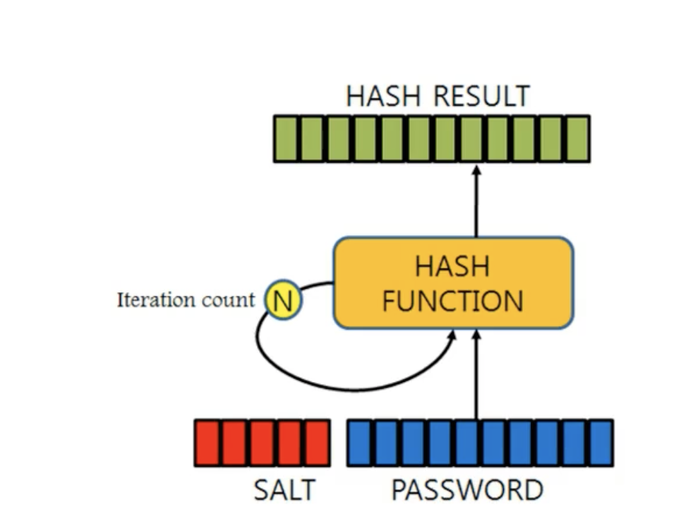
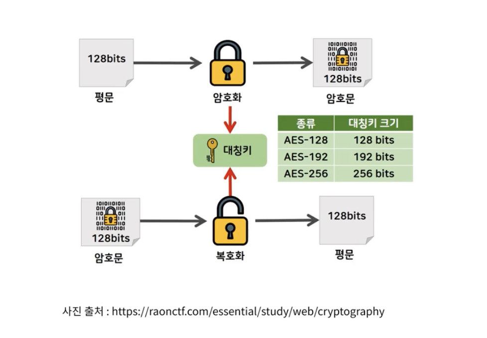
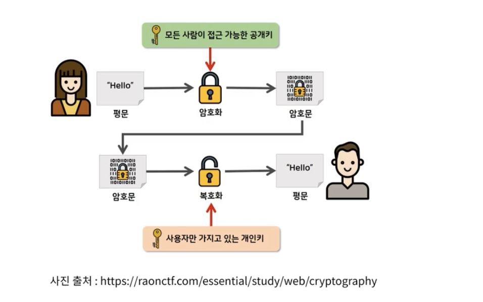

# 암호화
* Plain Text를 해독할 수 없는 CipherText(암호문)으로 변환하는 것을 의미한다.
  * 암호화가 적용되지 않으면 인터넷에 떠돌아다니는 패킷을 잡을 시 데이터를 누구나 확인할 수 있게 되는 위험이 존재함.
* 단방향(해싱)과 양방향 암호화가 존재한다.

## 단방향 암호화
* 해시 알고리즘을 이용하여 평문을 복호화 할 수 없는 형태로 암호화 함.(디코딩이나 부호화(암호화)된 정보를 못푼다는 거임)
* 대표적으로 MD5와 SHA알고리즘이 존재함.
* 사용자 비밀번호등을 저장할 때 자주 사용이 됨.
* MD5와 SHA-0, SHA-1은 해시 충돌이 발생할 수 있는 취약점이 존재하여 사용을 권하지 않음.

### 확인 절차

1. 클라이언트가 메시지 전송
2. 서버에서 메시지가 중간에 변경된것인지 아닌지를 키를 통해 판단
3. 변경되어 있지 않다는 판단하에 보낸 메시지의 해시값으 생성
4. 해시값을 서버로 전송
5. 이전에 받은 메시지의 해시값 생성 후, 해시값을 비교
6. 해시값 일지 -> 메시지 정상, 해시값 불일치 -> 메시지 비정상으로 판단

### 고려절차
* 해킹공격중 레인보우 테이블을 고려해야 함.
* 복호화가 불가능하지만 RainbowTable을 통해 원문을 알아낼 수 도 있음.
  * Rainbow Table은 평문과 해시함수로 만든 문자열을 모두 저장시켜놓은 표를 말함.
* 따라서 불의의 사고로 암호화된 데이터를 탈취 당하더라도 원문을 알아낼 수 없도록 조치를 해야함
* Salt , Key stretching을 이용해 해결이 가능함.

#### Salt

* 평문에 임의의 문자열을 추가하여 암호화하는 방법을 말함.
* 재료에 소금을 곁들여 먹는 것에 비유하는 방법
* Salt는 128bit 이상으로 만들것을 권장.
* 사용자마다 다른 Salt를 사용하게 되면 더 안전함.

#### Key Stretching

* 해시를 여러번 반복하여 원문을 알기 힘들게 만드는 방법
* 일반적인 시스템에서 0.2초 이상 반복되면 안전하다고 함.

#### Salt와 Key Stretching을 이용하는 알고리즘
* 직접구현하는 것보다 이미 검증받은 알고리즘을 사용하는 것이 안전함.
* PBKDF2
  * NIST(미국 표준 기술연구소)에서 승인된 알고리즘이고 DIGEST라고도 불린다고 함
* bcrypt
  * 비밀번호 저장을 목적으로 탄생
  * OpenBSD에서 기본적으로 사용하고 있는 알고리즘
  * Alg Cost Salt Hash로 이루어져있음.

## 양방향 암호화
* 평문을 복호화 할 수 있는 형태로 암호화 하는 방법
* 대칭키와 비대칭키 알고리즘으로 나뉘게 됨.
* 대표적으로 대칭키를 이용하는 AES와 비대칭키를 이용하는 RSA로 나뉨.

### 대칭키 암호 알고리즘

* 대표적으로 AES(Advanced Encryption Standard)가 있음.
* 같은 키를 이용하여 암호화, 복호화가 가능함.

### 비대칭키 암호 알고리즘

* 대표적으로 RSA(Rivet, Shamir and Adleman)가 존재함.
* 공개키와 개인키 두가지 키가 존재한다.
  * 모든사람이 아는 공개키와 서버(나)만 알고 있는 개인키가 존재하여 다소 안전함.
  * 클라이언트가 공개키를 통해 암호화된것을 보내면 서버에서 개인키를 통해 복호화가 가능해짐
  * HTTPS에서도 이런 방식이 쓰이고 있다고 함.
* RSA는 소인수 분해를 기반으로 만들어진 알고리즘이다.

## JS에서 이 모든 것을 이용하는 방법
* [crypto-js](https://github.com/brix/crypto-js)를 사용할 수 있다
* [node-js-bcrypt](https://github.com/kelektiv/node.bcrypt.js)crypto-js에서는 bcrypt가 구현되어 있지 않아 bcrypt 사용을 위해서는 해당 라이브러리를 추가로 써줘야한다.