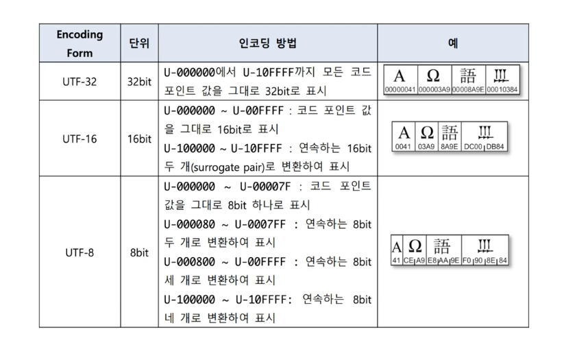
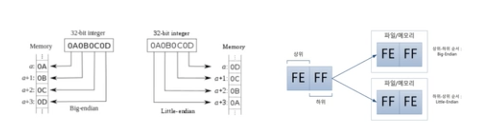
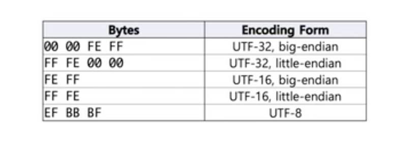

# 유니코드

문자가 브라우저에 그려지는프로세스는

값으로 이루어진 문자가 글꼴을 만나 렌더링 엔진을 통해 

브라우저에 그려지게 된다.

## CCS(Coded Character Set)
* 문자들을 Code Point에 대응시켜 만든 코드화된 문자들의 집합
  * Code Point는 정의해놓은 정수값이며 각 문자들의  (Character의) 식별자가 된다.
  *한글은  KS C 5601, ISO 10646 등이 존재한다.


## CES(Character Encoding Scheme)
* CCS를 octet(8bit) 집합에 대응시키는 것: 문자를 표현하는 기본단위가 8비트임
* 그래서, CCS와 CES는 1:1로 대응된다.
* 이게 흔히 말하는 인코딩에 해당한다.
  * 인코딩: Character를 시스템이 인식할 수 있는 값으로 변환하는 것
  * 디코딩: 인코딩된 값을 다시 Character로 변환하는 것
* UTF-8, UTF-16, euc-kr, CP 949등이 존재한다.

## TES(Transfer Encoding Syntax)
* 인코딩한 문자가 특정 프로토콜을 타고 전송되도록 변환하는 것
* 통신 프로토콜에 제약이 있을 수 있기 때문이다.
  * 예를 들어 , URL에서 공백은 사용할 수 없기에 변환을 해야한다.
* URL Encoding, BASE 64 Encoding등이 존재한다.

## 유니코드
* 유니코드는 전세계 문자를 컴퓨터에서 다룰 수 있도록 만든 표준시스템임
  * 다양한 나라가 서로 다른 인코딩 방식을 사용함으로서 호환성 및 확장성에 문제를 일으켰고 같은 문자여도 통신하면 깨지는 문제가 생김

* 2010년부터 이모티콘도 유니코드에 등록되었고 결국 전세계 문자를 컴퓨터에서 다룰 수 있도록 만든 표준시스템을 만들었다.
* [home.unicode.org](https://home.unicode.org)
### 유니코드 CCS

  * 코드 포인트 범위 - 0x0 ~ 0x10FFFF(1114112개 문자)
  * 유니코드는 실제로 4바이트 영역까지도 사용하고 있음
    * 일반적으로 사용하는 언어들이 담겨있는 영역이 bmp영역이다.
### 유니코드 CES

* Code Point가 어떤 단위로 조합되어 인코딩 되는지 정의 한 것
* 웹문서는 크기를 줄이기위해 8을 사용함
   UTF들은 재각기 다른 특징을 가지고 있는데 바이트 수도 다르고 BOM허용 여부도 다름


* Big-Endian과 Little-Endian은 컴퓨터 메모리에 저장된 바이트 순서를 말한다.
* Big Endian은 큰쪽에서 작은쪽으로 저장된다.(사람이 읽고쓰는 법과 유사함.)
* Little-Endian은 작은쪽에서 큰쪽으로 저장된다. (하위 바이트만 계산할때 별도의 계산이 필요없어 컴퓨터가 계산하기 편암함)


* BOM은 Byte Order Mark를 말하며 문서 제일 앞에 `U+FEFF`를 삽입하여 어플리케이션이 바이트 순서를 알 수 있게 해준다.
  * 인코딩을 변경하다 이것때문에 깨지는 일이 있음
  
```javascript
//아래 이모지는 4바이트로 구성되어 있음
const poo = "💩";
// 4바이트이기에 각 코드포인트가 두개로 이루어짐.
//서로 게이트 페어 방식임
//첫번째가 서로게이트 문자가 될듯
console.log(poo.charCodeAt(0).toString(16));
//Code Point => 0xD83D
console.log(poo.charCodeAt(1).toString(16));
//Code Point => 0xDCA9

// \u를 통해 유니코드 문자를 표현할 수 있다.
const unicodePoo = "\uD83D\uDCA9";
console.log(unicodePoo); // "💩"

//true
console.log(poo === unicodePoo);

//이모지는 4바이트이기에 문자열길이 2를 차지 한다.
console.log(poo.length);

// 유니코드에서 영어든 한글이든 2바이트로 읽힌다.
// 따라서 한글은 한 글자당 길이를 1 차지한다.
console.log("한글".length);
```