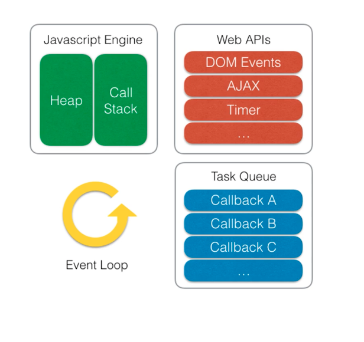

# 이벤트 루프
JS는 싱글스레드 언어로 하나의 CallStack만 존재한다.

브라우저에서 실행되는 스크립트는 어떻게 애니메이션과 클릭이벤트 등을 같이 처리할 수 있을까



* 이벤트루프는 자바스크립트엔진에 포함된것이 아님 - > 브라우저나 Node JS엔진이 관리하는것
*  위의 그림처럼 브라우저에서 제공하는 WEB API를 통해 들어온 클릭, 네트워크 호출, 타이머등이 해당되고 이는 브라우저에게 위임됨
*   위임된 API 들은 보통 콜백함수를 가지기 때문에 콜백함수들은 비동기작업이 끝나면 task Queue에 들어가 순차적으로 이벤트루프가 꺼내서 Call Stack에 푸쉬됨
* 그래서 결국 이 일련의 과정은 멀티쓰레드로 동작하게됨
  * JS는 싱글스레드가 맞음
  * 브라우저는 멀티스레드로 동작하기에 위와같은 과정이 가능함.

    # 예제
    ```javascript
    const foo = () => {
    console.log("foo");
  };

  const bar = () => {
    console.log("bar");
  };

  setTimeout(()=>{ //첫번째 setTimeout
    bar();
  },100)

  foo();

  setTimeout(()=>{ //두번째 setTimeout
    console.log("baz")
  },100)
  ```
  * 스크립트 실행시  전역 scope내에서 실행됨
  *  첫번째 setTimeout이 콜스택으로 들어가게 됨과 동시에 브라우저내부적으로 webAPI가 실행 됨
  *  setTimeout은 특별히 실행하는 로직이 없기때문에 콜스택에서 바로 pop(없어지게 된다)
  * 다음은 foo의 실행텍스트가 콜스택으로 들어가게 됨(이때 WebAPI로는 안감)
  * foo 함수 안쪽의 console.log가 스택에 쌓이게 되고 로그가 실행되고 난 후 스택에서 console.log가 사라짐
  * foo함수도 스택에서 사라짐
  * 두번째 setTimeOut도 콜스택에 쌓이게 되고 동시에 브라우저 내부적으로 webAPI에 setTimeout이 실행됨
  * 역할이 종료되었으므로 콜스택에서 빠지게 됨
  * 스크립트 종료 -> 글로벌 스콥도 종료되어 콜스택에서 나오고
  * webAPI에서 실행된 setTimeout은 시간이 지나 콜백함수를 TaskQueue에 넣게 됨
  * 이 때 Queue에 들어간 콜백함수는 콜스택이 비어있는 경우 이벤트 루프를 통해 콜스택에 쌓이게 됨 -> 이걸 틱이라고 함(비어있어야 들어가는 거)
  * 두번째 콜백은 아직 콜스택이 비어있지 않아서 태스크큐에 들어있게 됨
  * 각 익명함수인 콜백함수(내부 실행함수)가 콜스택에 쌓이고 실행되고 끝나게 됨. -> [cb => bar() => console.log("bar")... cb2 => console.log('baz')]