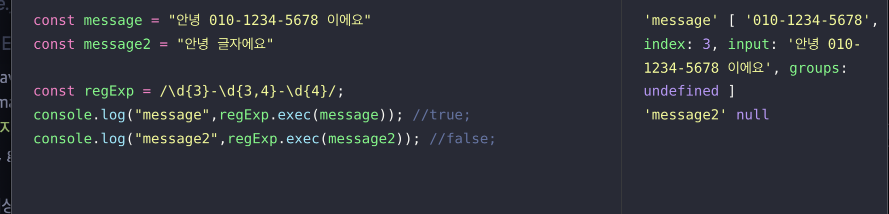
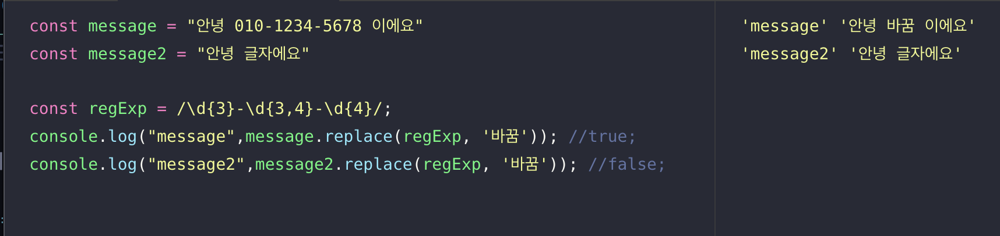

# 정규표현식

* 정규표현식의 목적은 패턴을 이용하여 검색, 대체, 추출하는 것임
* 성능은 느리나 너무 간편해서 사용함
  * [rubular.com](https://rubular.com)에서 확인가능
  * [regexone.com](https://regexone.com)에서 연습가능

## 휴대폰 번호를 찾아보자
* 정규표현식을 사용하기 위해서는 패턴을 찾는게 가장 중요함.
* 휴대폰 번호패턴은?
  * 010-1234-5678
  * 011-123-4566
  * 01X-XXX(X)-XXXX
  * 국가번호와 안심번호등은 예외케이스는 제외
* `세자리 숫자, 하이픈, 셋 혹은 네자리숫자, 하이픈, 네자리숫자의 패턴`으로 이루어진걸 알 수 있음
* `/\d{3}-\d{3,4}-\d{4}/i`

## 이메일 주소 중 중간문자열만 뽑고 싶다면
* 이메일 주소패턴은 ?
  *  abcd32@naver.com
  * abcd32@gmail.co.kr
* `문자열,@,문자열.,문자열` 패턴이 보임
* 여기서 naver, gmail만 뽑고싶으면 ?
    ```md
    .+ => 한개이상의 문자열
    (...) => 캡쳐
    ```
* `.+@(.+)\..+`

## JS에서 사용

### test
정규 표현식 객체의 test함수는 입력받은 문자열에 찾는 패턴이 있는지 찾은 후 있으면 true없으면 false 반환해준다
```javascript
const message = "안녕 010-1234-5678 이에요"
const message2 = "안녕 글자에요"

const regExp = /\d{3}-\d{3,4}-\d{4}/;
console.log(regExp.test(message)); //true;
console.log(regExp.test(message2)); //false;
```

### exec

입력받은 문자열에 찾는 패턴이 있는지 찾은 후 일치한 패턴정보를 반환하고 없으면 null을 반환함.
문자 추출에 해당함


## match
String 객체의 match 함수는 정규표현식 객체를 파라미터로 받아 패턴이 있는지 찾은 후 일치한 패턴정보를 반환하고 없으면 null을 반환함. 정규표현식 객체의 exec함수의 같음
* matchAll은 전체 반환

## replace

- 일치한 패턴 정보를 원하는 문자열로 바꿀 수 있음
- 일치하는 모든 것을 바꾸고 싶으면 정규표현식의 플래그에 `g`를 붙여주면 된다

## search
일치한 패턴정보의 위치를 반환함. 문자 검색에 해당
- 처음 찾은것만 반환해주기 때문에 전부 알고 싶다면 matchAll을 사용해야 한다.

# Run-length encoding
* 매우 간단한 비손실 압축방법
* "AAAAAABBBDFFFFFFFKK"문자열을 어떻게 압축할 것인가?
* "6A3B1D7F2K"로  압축할 수 있음
  * 6개의 A, 3개의 B, 1개의 D, 7개의 F, 2개의 K

* 패턴을 발견할 수 있는가?

역슬래쉬 1이 첫번째 캡쳐를 이용하겠다는 뜻임
캡쳐를 통해 각 문자별로 그룹화가 됨
```javascript
const raw = "AAAAAABBBDFFFFFFFKK";
const compressed = '6A3B1D7F2K';

const regExp = /(.)\1*/g;

let result = raw.match(regExp).reduce((a,b)=> a + `${b.length}${b.slice(0,1)}`, "");

console.log(result === compressed);
```