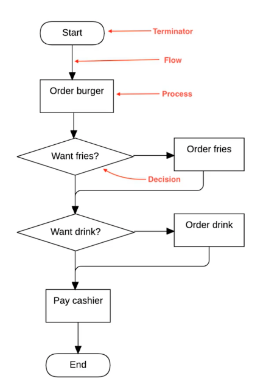

# 흐름제어

## Control Flow

흐름을 제어하는 방법 중 하나로 조건이나 반복을 통해 상태를 제어하는 것을 의미한다.
for나 if를 사용할 수 있음.


### Control Flow
Goto , if/Then/Else, Switch/Case, For/While => 일반적으로 알고있는 조건문이나 반복문
```javascript
let a = [1,2,3,4,5];
for(let i = 0; i < 5; i+=1) {
  if(a[i]%2 === 0) {
    console.log(a[i]);
  }
}
```

### Data Flow
Stateless, Recursion, Pipe => 함수형프로그래밍으로 가능함.
```javascript
[1,2,3,4,5]
  .filter((item)=> item % 2 === 0)
  .forEach((item)=> console.log(item));
```

## 조건문
조건이 맞을 때만 실행되는 문장(Statements)문법이다.

### If
JS에서는 문장문법인 if를 통해 구현 가능
```javascript
const a = 10;
const b = 20;

if(a<b){
  //참일 때 실행
} else{
  //참일때는 무시
}

if(a>b){
  //거짓이기에 무시
} else if(a===b){
  //마찬가지로 무시
} else{
  //실행
}
```

#### 주의 해야할 점
아래 값들은 다 Falsy임, 아래를 제외한 다른 값들은 Truthy임
```javascript
//아래는 다 거짓을 취급 됨
if(false) { }
if(undefined) { }
if(null) { }
if(0) { }
if(NaN) { }
if('') { }
```

### Switch
```javascript
const grade = "B";

switch(grade){
  case "A":
    console.log("A grade");
    break; // break미 사용인 경우 다음으로 진행되어 의도치 않은 출력발생
  case "B":
    console.log("B grade");
    break;
  case "C":
    console.log("C grade");
    break;
  default:
    console.log("Unknown");
}
```

## 반복문
반복적 작업을 지시하는 문법

### for
기초적 반복문으로 초기문, 조건문, 증감문으로 이루어짐
`조건문의 결과가 거짓이되면 반복 종료`가 된다.

```javascript
// for(초기문; 조건문,; 증감문)
for(let i = 0; i < 10; i +=1) {
  console.log(i);
}
```

### while
괄호안의 조건이 거짓이 될 때 까지 반복 됨
```javascript
let x = 0;
while( x < 10) {
  x += 1;
  console.log(x);
}
```

### do- while
while문과는 다르게 먼저 진입 후 로직 실행한 다음 조건 실행하게 됨
```javascript
let x = 0;

do{
  console.log("Fire);
}while(x>10);
```