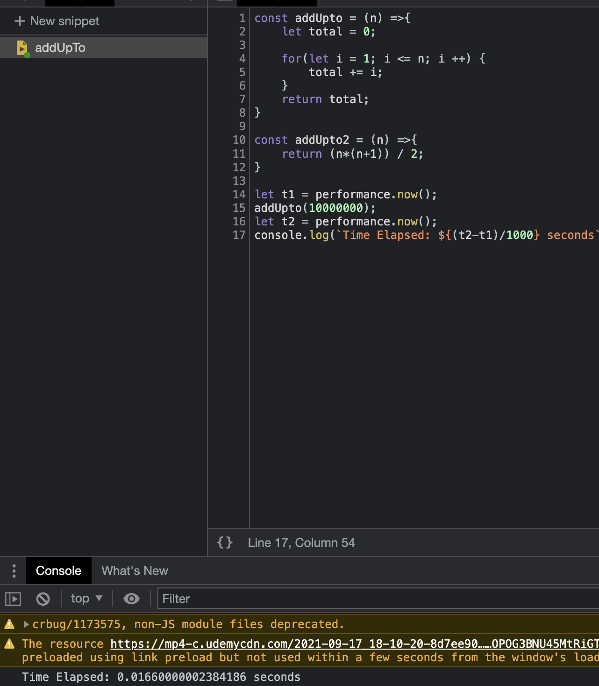

# 좋은코드란?
* 빠른가?
* 메모리를 덜 쓰냐 ?
* 읽기 좋냐?

보통 사람들은 위 두가지(빠름, 메모리 적음)를 좋은코드의 척도로 여기고는 함.

## 코드속도 측정은 어케하나

### 속도 측정의 문제
* 기기마다 다르게 나올 문제가 있음
* 심지어 같은 기기도 다른 시간을 측정해버림
* 빠른 알고리즘의 경우 정확하지 않을 수 있음

### 그래서 어떻게 하면 되냐
* 변화가 많은 seconds를 세는게 아니라 컴퓨터가 처리해야하는 연산의 갯수를 세면 된다.
*  간략하게 알기 편하기 위해 Big O Notation이 필요함.
* 연산자(+, * , / , %, = )등이 몇번 행해지는지를 판단해보자
  * 사실 이걸 다 세는게 귀찮고 힘듬
  * 그래서 BIG O는 걍 시간 복잡도를 크게 보는 거임

