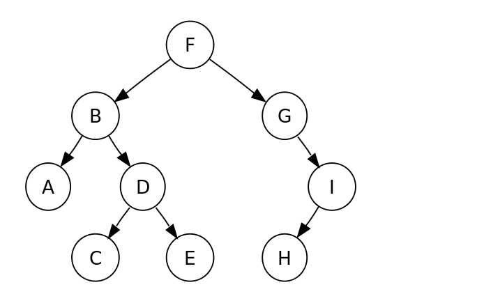

# PreOrder - 전위 순회
1. 노드를 방문한다
2. **왼쪽**서브트리를 전위 순회한다.
3. **오른쪽** 서브트리를 전위 순회 한다.
* 전위 순회는 깊이 우선순회(DFS)라고도 한다

# InOrder - 중위 순회
1. 왼쪽 서브트리를 중위 순회한다.
2. 노드를 방문한다.
3. 오른쪽 서브트리를 중위 순회한다
* 대칭순회(Symmetric)라고도 한다
```javascript
  var inorderTraversal = function(root) {
    let result = []; //방문한 애들을 담을 배열
    if(!root) return result; //엣지케이스 처리
    let stack = []; // 탐색을 위한 스택
    let current = root;

    while(current || stack.length) {
      while(current) {
        stack.push(current);
        current = current.left; //왼쪽서브트리부터 stack에 다 넣어줌
      }
      //현재 노드 방문 처리
      current = stack.pop(); 
      result.push(current.val); 
      //오른쪽을 탐색해봄
      current = current.right;
    }
    return result;
};
```

# PostOrder - 후위 순회
1. 왼쪽 서브트리를 후위순회한다
2. 오른쪽 서브트리를 후위순회 한다.
3. 노드를 방문한다.

# Breadth Frist - 깊이(레벨) 순서 순회
1. 모든 노드를 낮은 레벨 부터 차례대로 순회한다
2. 각 레벨의 **왼쪽** 노드 값 부터 순회한다..

```javascript
var levelOrder = function(root) {
  if (!root) {
      return []
  }
  const result = []
  const que = [root]
  
  while(que.length) {
      const row = []
      const qlen = que.length
      for (let i = 0; i < qlen; i++) {
          const cur = que.shift()
          row.push(cur.val)
          if(cur.left) que.push(cur.left)
          if(cur.right) que.push(cur.right)
      }
      result.push(row)
  }
  
  return result
};
```

## 결과
- 
위 그림의 탐색 결과는 아래와 같다.
* 전위 순회(root,left, right) : [F, B, A, D, C, E, G, I, H]
* 중위 순회(left, root, right): [A, B, C, D, E, F, G, H, I]
* 후위 순회(left, right, root): [A, C, E, D, B, H, I ,G ,F]
* 레벨 순서 순회: [F, B, G, A, D, I, C, E, H]

# 참고
- [위키-트리순회](https://ko.wikipedia.org/wiki/%ED%8A%B8%EB%A6%AC_%EC%88%9C%ED%9A%8C)